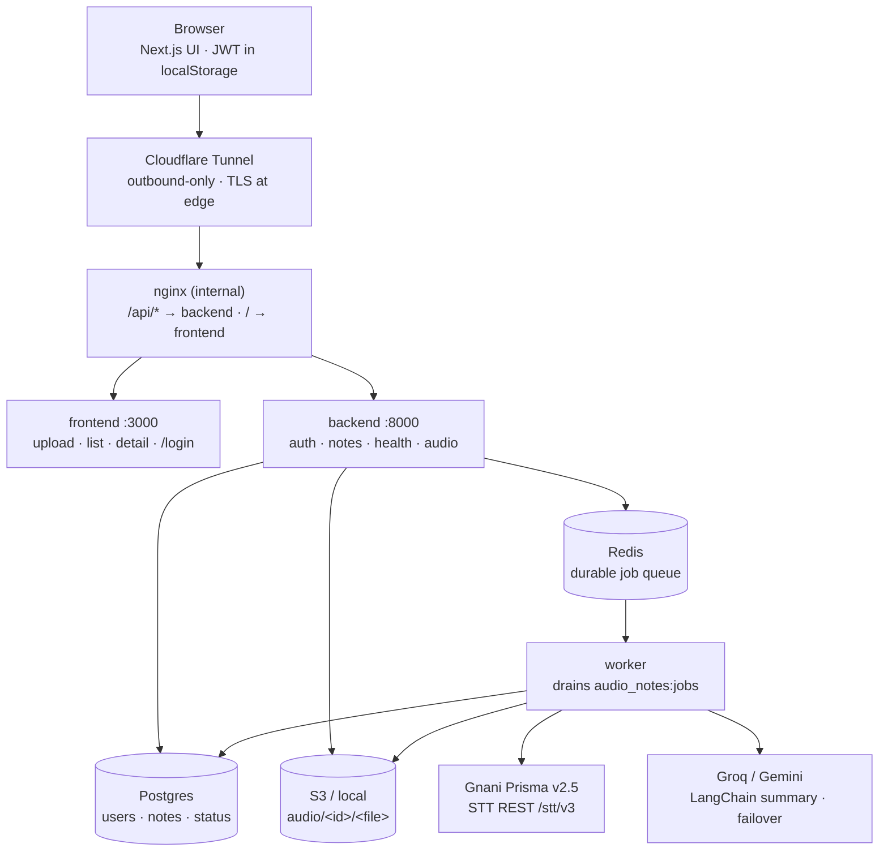
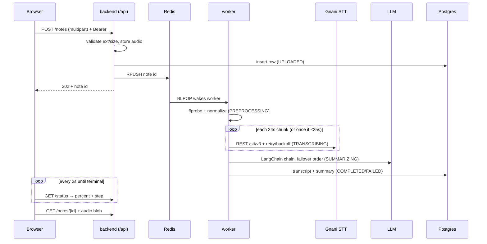

# Architecture — Audio Notes Platform

Technical companion to the in-app `/architecture` page. Live at
`https://gnani.harsh-shah.me`. Repo: `https://github.com/Enky-yy/gnani-home-assessment`.

## 1. Services (`docker-compose.yml`)

| Service | Image / build | Role |
|---|---|---|
| `frontend` | `frontend/Dockerfile` (Next.js 14 standalone) | UI on `:3000` |
| `backend` | `backend/Dockerfile` (FastAPI/uvicorn) | API on `:8000` |
| `worker` | same backend image, `scripts/worker.py` | drains Redis queue |
| `db` | `postgres:16-alpine` | state + transcripts + summaries |
| `redis` | `redis:7-alpine` | durable job queue `audio_notes:jobs` |
| `nginx` | `nginx:alpine` + `nginx.conf` (internal only) | `/api/*` → backend, `/` → frontend, 500M bodies, 300s timeouts |
| `tunnel` | `cloudflare/cloudflared` | `gnani.harsh-shah.me` → `http://nginx:80`, TLS at edge |

Postgres and uploads persist in `postgres_data` / `backend_uploads` volumes.

## 2. Upload → transcript → summary

1. **Upload** — Browser posts `multipart/form-data` to `POST /api/v1/notes`
   (`backend/app/api/v1/endpoints/notes.py`). Extension allowlist + 500MB cap
   enforced pre-save (declared size) and post-save (actual size, orphan
   cleanup, `413`). Stored under `audio/<note_id>/<filename>` (S3 via boto3 +
   presigned playback URLs, or local partitioned layout with traversal
   protection). DB row created in `UPLOADED`, API returns **202** immediately.
2. **Enqueue** — Note id pushed to Redis (`app/services/queue.py`); without
   `REDIS_URL` the API falls back to in-process `BackgroundTasks`.
3. **Worker** (`app/services/job_runner.py`) — downloads to scratch dir,
   ffprobe validation (`PREPROCESSING`), then Gnani ASR (`TRANSCRIBING`):
   - `≤ GNANI_MAX_REST_AUDIO_SECONDS` (25s): normalize → single REST call.
   - `> 25s`: 24s FFmpeg chunks with 1s overlap at 16kHz mono, transcribed
     serially (rate-limit safe), stitched with word-level overlap merging.
   - Every clip is normalized first: 16kHz mono WAV + 80Hz–7.5kHz speech band
     + EBU R128 loudness (`AudioService.normalize_to_wav`). Each Gnani success
     logs its `request_id`.
4. **Summarize** (`SUMMARIZING`, `app/services/summarizer.py`) — LangChain
   `Prompt | LLM | Parser` chain producing TL;DR, key points, action items,
   sentiment. Provider failover: configured provider first, then every other
   keyed provider; `.env.example` placeholders never count as keys; labeled
   extractive fallback only as last resort. Saved transcripts can be
   re-summarized anytime via `POST /api/v1/notes/{id}/summarize` (no ASR cost).
5. **Persist** — transcript, segments, summary → Postgres, note → `COMPLETED`
   (or `FAILED` with the exact error + Retry). Scratch dir cleaned up.
6. **Read** — Frontend polls lightweight `GET /status` every 2s (percent +
   `current_step`), then loads the full note. Audio streams from
   `GET /{id}/audio` (S3 redirect or local file).

**Storage honesty:** the interface supports S3 (boto3 + presigned URLs) and
local disk per note, but the live deployment currently runs **local disk**
while the new AWS account activates — cutover is config-only, no migration.

## 3. Long audio

Gnani REST caps at 30s ideal, so `> 25s` audio is sliced into 24s overlapping
chunks, each within the ideal window. Serial execution + pacing sleeps respect
429 limits with exponential backoff; the shared ~1s overlap is collapsed by
suffix/prefix word merging (min 3 words, case/punctuation-insensitive) so seams
don't duplicate phrases. Verified live: 150s narration → 7 chunks → COMPLETED
in ~50s with a quality transcript.

## 4. Sync vs background

- **Synchronous:** validation, storage write, DB insert, 202 response, status
  reads, audio streaming, rename/delete, re-summarize (single LLM call).
- **Background:** storage download, ffprobe, normalization, chunking, Gnani
  calls, LLM summarization, final DB write, cleanup.

## 5. Failure handling (all visible, per the brief)

- Corrupt/empty audio → `FAILED` with ffprobe reason + Retry.
- Expired Gnani key (401/403): never retried; single clip fails loudly, chunked
  audio fails only if *all* chunks error, partial results survive.
- Dead LLM key/quota: failover to next provider → labeled extractive fallback
  (`llm_model_used`), never a silent wrong model.
- Missing keys: Gnani demo-simulation mode and extractive engine, both reported
  by `/api/v1/health` (which also reports DB, storage, queue depth).
- No fake successes: every terminal state reflects what actually happened.

## 6. Auth & private notes

Email + password (`POST /api/v1/auth/register`, min 8 chars, bcrypt-hashed;
`POST /login` returns a 7-day JWT). Every note carries `owner_id`; all note
endpoints require `Authorization: Bearer` and scope to the caller — cross-user
access returns 404 (no existence leak), legacy ownerless rows are hidden from
everyone. Audio streams via authenticated blob fetch (the `<audio>` element
can't send headers). `init_db` adds the column idempotently for pre-auth
databases. Secrets: `JWT_SECRET` in `backend/.env` (generated random).
Reviewers skip registration via the public demo account
(`demo@example.com` / `demo1234`, seeded with 2 completed notes by
`scripts/seed_demo_data.py`, credentials shown on `/login`).

## 7. Frontend (`frontend/`)

Next.js 14 App Router + Tailwind. `/login` (login/register), `/` (upload +
history), `/notes/[id]` (player, progress, transcript, summary,
rename/retry/re-summarize/delete), `/architecture`. Unauthenticated visits
redirect to `/login`; 401s log out. Browsers call same-origin `/api/*` via
nginx; server pre-render uses `BACKEND_INTERNAL_URL` (Node `fetch` needs
absolute URLs). Uploads get client-side extension + size checks mirroring the
backend.

## 8. Configuration

Secrets live in `backend/.env` (git-ignored; placeholders in `.env.example`):
`DATABASE_URL`, `REDIS_URL`, `STORAGE_BACKEND` + S3 keys, `GNANI_API_KEY`,
`JWT_SECRET`, `LLM_PROVIDER` + `GEMINI/GROQ/OPENAI` keys + models,
`MAX_UPLOAD_SIZE_MB`.
Tunnel token lives in root `.env` as `CLOUDFLARE_TUNNEL_TOKEN`. See `DEPLOY.md`.

## 9. Tests

31 pytest tests (`backend/app/tests/`): auth (register/login/validation/
isolation/legacy-hidden), ffprobe validation, normalization output, overlap
merging, chunk all-fail vs partial-fail, LLM failover + placeholder guard,
resummarize endpoint, upload/list/status/rename/delete, 65s chunked e2e,
summarizer shape. Run: `pytest app/tests/ -v`.

## 10. Operations

- **Health:** `GET /api/v1/health` reports database, storage backend,
  queue backend + depth, Gnani mode (`active` vs `demo-simulation-mode`) and
  LLM mode (`active (provider)` vs `extractive-fallback-mode`) — the first
  place to look when output degrades.
- **Tracing:** every Gnani success logs its `request_id`; worker and API
  logs carry note ids on every state transition (`UPDATE ... → TRANSCRIBING
  (40%): ...`), so any note's history is greppable.
- **Failure drills already survived:** duplicate tunnel connectors (flaky
  502s), nginx caching dead upstream IPs after rebuilds (runtime DNS fix),
  retired Groq models (model-ID refresh via the provider's own models API).
- **Keep-alive:** the host must stay on with `docker compose up`; tunnel +
  `restart: unless-stopped` recover from reboots, Postgres/uploads live in
  named volumes.

## 11. With more time

Gnani Batch STT for long files (full-context, zero seams; loses gu-IN/pa-IN),
SSE instead of status polling, speaker diarization + word timestamps,
full-text search ranking, parallel chunk workers with a token bucket once
quotas allow. (Auth with per-user scoping shipped — see section 6.)
